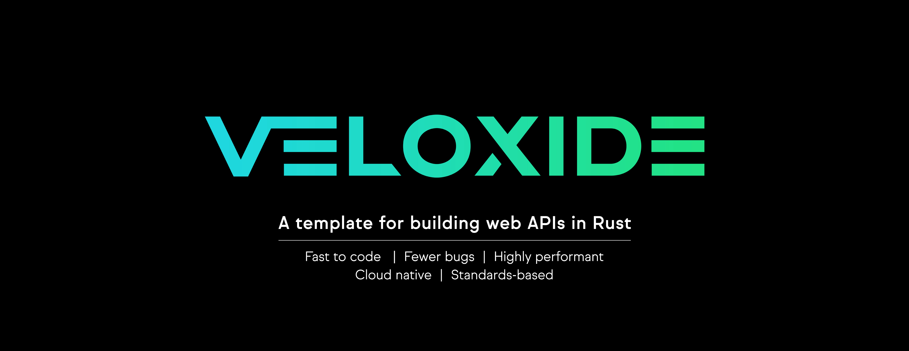

<!-- markdownlint-disable MD033 -->
<!-- markdownlint-disable MD041 -->

<p align="center">
    <a href="https://github.com/liamwh/Veloxide"></a>
    <p align="center">
</p>

---

## Frontend Development

## Requirements

- [Node.js](https://nodejs.org/en/)
- A package manager, [pnpm](https://pnpm.io/) is recommended

## Getting started

Install dependencies with `pnpm install`, then start a development server:

```bash
pnpm run dev

# or start the server and open the app in a new browser tab
pnpm run dev -- --open
```

## Building

To create a production version of your app:

```bash
pnpm run build
```

You can preview the production build with `pnpm run preview`.
